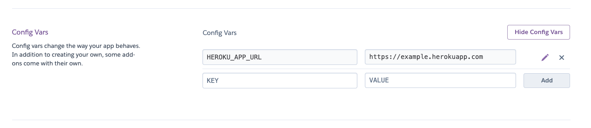

# Heroku Always Up :rocket:

The purpose of this repo is to keep always available the free dyno heroku application you want.

BThere are some restrictions on this issue. As mentioned below, **every 30 minute sleeps** if there is no traffic during this periods. In addition, each personal account has **550 free dyno hours per month**. If your application is always up, this period will be exhausted before the end of the month.

* Sends a request to the your application **every 20 minutes**
* Requests are not sent between **02:00am** and **08:00am**. In this way, your free dyno hour is enough for the whole month.

```
Dyno sleeping
If an app has a free web dyno, and that dyno receives no web traffic in a 30-minute period, it will sleep. In addition to the web dyno sleeping, the worker dyno (if present) will also sleep.
```

```
Free dyno hour pool
Personal accounts are given a base of 550 free dyno hours each month. In addition to these base hours, accounts which verify with a credit card will receive an additional 450 hours added to the monthly free dyno quota. This means you can receive a total of 1000 free dyno hours per month, if you verify your account with a credit card.
```

[https://devcenter.heroku.com/articles/free-dyno-hours](https://devcenter.heroku.com/articles/free-dyno-hours)

## Usage :fire:

First of all, you should deploy this repo by cloning or clicking the button below.

[](https://heroku.com/deploy?template=https://github.com/tolgacesur/heroku-always-up)

You should add `HEROKU_APP_URL` as the enviroment variable in the `Settings` tab of the deployed application as follows. Instead of `https://example.herokuapp.com `simply type the address of the heroku application you want.



Finally, you can apply your changes with the **Manually Deploy** option from the Deploy tab.

## Contributing
Pull requests are welcome. For major changes, please open an issue first to discuss what you would like to change.

Please make sure to update tests as appropriate.

## License
[MIT](https://choosealicense.com/licenses/mit/)